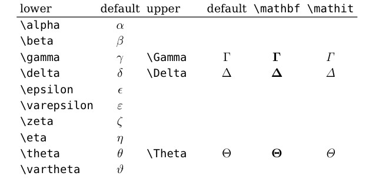
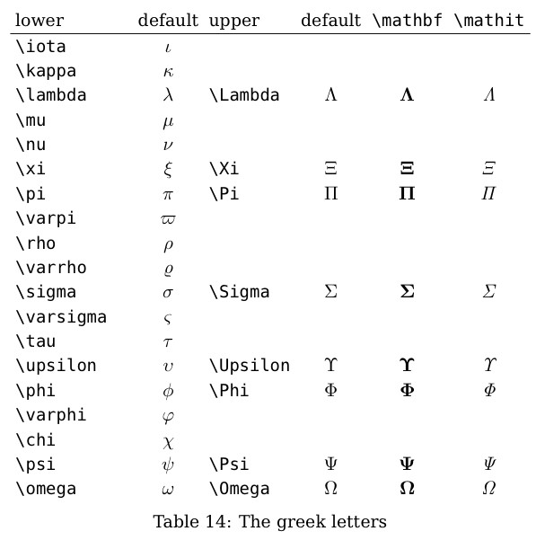

# Markdown
## 一、标题
```
# 这是一级标题
## 这是二级标题
### 这是三级标题
#### 这是四级标题
##### 这是五级标题
###### 这是六级标题
```
显示效果：
# 这是一级标题
## 这是二级标题
### 这是三级标题
#### 这是四级标题
##### 这是五级标题
###### 这是六级标题

## 二、字体
```
**这是加粗的文字**
*这是倾斜的文字*`
***这是斜体加粗的文字***
~~这是加删除线的文字~~
```
显示效果：
**这是加粗的文字**

*这是倾斜的文字*

***这是斜体加粗的文字***

~~这是加删除线的文字~~

## 三、引用
```
>这是#1引用的内容
>>这是#2引用的内容
>>>>>>>>>>这是#n引用的内容
```
显示效果：
>这是#1引用的内容
>>这是#2引用的内容
>>>>>>>>>>这是#n引用的内容

## 四、列表
```
- 列表内容
+ 列表内容
* 列表内容
```
显示效果：
- 列表内容
+ 列表内容
* 列表内容

## 五、分割线
```
---
----
***
*****
```
显示效果：
---
----
***
*****

## 六、代码
```
(```)
code
(```)
```
ps:使用时，（）要去掉
显示效果：
```
code
```

## 七、图片
1. 一般导入图片的方式
```

Example:

```
显示效果：


2. 设置图片的大小（以10%为例子），位置（以左为例子）
```

Example:

```
显示效果：<br>

<br>
## 八、超链接
```
[超链接名](超链接地址)
Example:
[GitHub](https://github.com/)
```
显示效果：
[GitHub](https://github.com/)

## 九、表格
```
|表头|表头|表头|
|---|:---:|---:|
|内容|内容|内容|
|内容|内容|内容|
```
显示效果:

|表头|表头|表头|
|---|:---:|---:|
|内容|内容|内容|
|内容|内容|内容|

## 十、公式
```
$ y = a + b x $
```
显示效果：<br>
$ y = a + b x $

### 上标
$ a^2 $

### 下标
```
$ Pa(s,s') = Pr(S_{t+1} = s' | st = s, at = a) $
```
显示效果：<br>
$ Pa(s,s') = Pr(S_{t+1} = s' | st = s, at = a) $

### 从属
∈
$\in$

### 求和
$\sum$ 

### 大小
≤: $\leq$
≥: $\geq$
≠: $\neq$

### 数学符号

